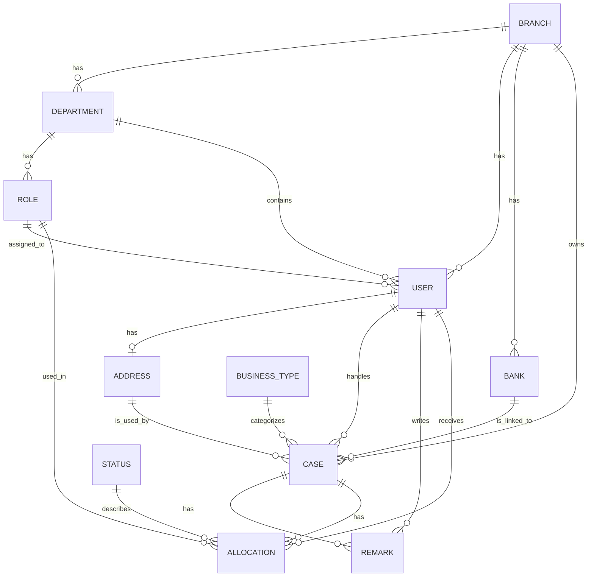

# ER Diagram Guide (Simple Language)

This guide explains the database design in a simple way. It is meant for anyone who wants to understand the main entities and how they connect without reading every Prisma file in detail.

## 1. Big idea

The system is built around people, offices, and cases.

- A Branch is a main office or location.
- A Department belongs to a Branch.
- A Role belongs to a Department.
- A User is an employee and belongs to a Branch, Department, and Role.
- A Case is a work item or request handled by a user.
- A Bank, Address, Remark, and Allocation are supporting parts of the system.

## 2. Simple ER diagram

## 3. How to read this diagram

- `||` means one.
- `o{` means many.
- `|o` means optional one.

So, for example:

- One Branch can have many Departments.
- One Department can have many Roles.
- One User belongs to one Branch, one Department, and one Role.
- One Case can have many Remarks and many Allocations.

## 4. Main entities and what they mean

| Entity       | Simple meaning                     | Main relationship                                  |
| ------------ | ---------------------------------- | -------------------------------------------------- |
| Branch       | A company office or location       | Has departments, users, banks, and cases           |
| Department   | A unit inside a branch             | Belongs to a branch and has roles and users        |
| Role         | A job position inside a department | Assigned to users and used in allocations          |
| User         | An employee or staff member        | Belongs to a branch, department, role, and address |
| Address      | A physical address                 | Linked to a user or bank                           |
| Bank         | A financial institution            | Belongs to a branch and is linked to cases         |
| BusinessType | A category for a case              | Used to classify cases                             |
| Case         | A work item or request             | Belongs to a branch, bank, user, and address       |
| Remark       | A note or comment                  | Added to a case or related entity                  |
| Allocation   | A task assignment for a case       | Links a case, user, role, and status               |
| Status       | Current stage of an allocation     | Describes where the allocation is in the workflow  |

## 5. Relationship summary in plain English

### Branch → Department → Role → User

This is the main organization structure.

- A Branch can have many Departments.
- A Department can have many Roles.
- A Role can be assigned to many Users.
- A User belongs to one Branch, one Department, and one Role.

### User → Address

A user has one address record.

### Bank and Case

A Bank is linked to Cases, and each Case also belongs to a Branch.

### Case → Remark and Allocation

A Case can have many remarks and many allocation records.

## 6. Why this design is useful

This structure helps the application:

- keep employee data organized,
- track which department and role a person belongs to,
- manage work items such as cases,
- record notes and assignments clearly,
- and keep audit information for changes and actions.

## 7. Quick example

If a user is created as an Engineer in the Finance Department of a Branch, then:

- the user is linked to that Branch,
- the user is linked to that Department,
- the user is linked to the Engineer Role,
- and the user can then be assigned to one or more Cases.

## 8. Notes for developers

When you read or update this schema, think in terms of:

- who owns the record,
- which parent entity it belongs to,
- and whether it is a one-to-many or many-to-many relationship.

This simple view is enough to understand the database structure before diving into the full Prisma schema.
