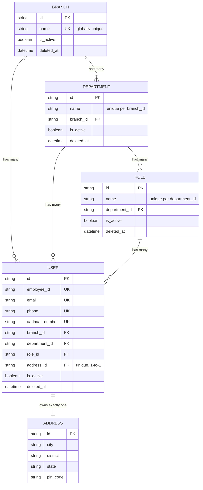

# Prisma Schema Documentation

> **Database:** PostgreSQL
> **ORM:** Prisma 7
> **Client output:** `src/generated/prisma`
> **Schema folder:** `prisma/schema/`
> **Migrations folder:** `prisma/migrations/`
> **Connection config:** `prisma.config.ts` → `process.env.DIRECT_URL`

This document covers the **organisational core**: `Branch → Department → Role → User (→ Address)`.
`Bank`, `BusinessType`, `Case`, `CaseUpdateHistory`, and `Remark` live elsewhere in `prisma/schema/` and are documented separately — they reference `User` (created_by/updated_by/assigned_to) but are not part of the org hierarchy below.

---

## Table of Contents

1. [The hierarchy, in one sentence](#the-hierarchy-in-one-sentence)
2. [ER Diagram (Mermaid)](#er-diagram-mermaid)
3. [ER Diagram (ASCII)](#er-diagram-ascii)
4. [Models](#models)
   - [Branch](#1-branch)
   - [Department](#2-department)
   - [Role](#3-role)
   - [User](#4-user)
   - [Address](#5-address)
5. [Delete semantics: hard delete vs soft delete vs is_active](#delete-semantics-hard-delete-vs-soft-delete-vs-is_active)
6. [Known design trade-off: denormalized FKs on User](#known-design-trade-off-denormalized-fks-on-user)
7. [Indexes & Constraints](#indexes--constraints)

---

## The hierarchy, in one sentence

A **Branch** contains many **Departments**; each **Department** contains many **Roles**; each **Role** contains many **Users**; and every **User** also holds direct pointers back to their **Branch** and **Department** (not just through their Role), plus a 1:1 **Address**.

```
Branch  1───∞ Department  1───∞ Role  1───∞ User  1───1 Address
  ▲                 ▲                          │
  └─────────────────┴───────── User also holds branch_id + department_id directly
```

Nothing here is many-to-many — every arrow below is a strict "child holds the parent's id" foreign key.

---

## ER Diagram (Mermaid)



> Render this block in any Mermaid-aware viewer (GitHub, VS Code Markdown Preview, Claude Artifacts) to see the boxes-and-arrows version.

---

## ER Diagram (ASCII)

```text
┌───────────────────────────────┐
│            Branch             │
│  id · name (unique)           │
│  is_active · deleted_at       │
└───────────────┬────────────────┘
                │ 1 : many                                  ┌──────────────────┐
                ▼                                           │                  │
      ┌───────────────────────┐   1:many                    │        ▲
      │      Department       ├──────────────┐              │        │ direct FK
      │ id · name             │              ▼              │        │ (branch_id)
      │ branch_id ────────────┤        ┌─────────────┐       │        │
      │ is_active · deleted_at│        │    Role     │       │        │
      └───────────┬───────────┘        │ id · name   │       │        │
                   │ 1:many             │department_id├──┐    │        │
                   │ (direct FK)        │is_active    │  │    │        │
                   │                    └──────┬──────┘  │    │        │
                   │                           │1:many    │    │        │
                   │                           ▼          │    │        │
                   │                    ┌───────────────────────────────┴──┐
                   └───────────────────►│               User               │
                                        │ id · employee_id · email · phone │
                                        │ aadhaar_number · is_active       │
                                        │ branch_id ────────────────────┐  │
                                        │ department_id ────────────────┤  │
                                        │ role_id ───────────────────────┘ │
                                        │ address_id (unique) ─────────────┼──┐
                                        └───────────────────────────────────┘  │
                                                                               ▼
                                                                     ┌──────────────────┐
                                                                     │      Address       │
                                                                     │ id · city · state  │
                                                                     │ district · pin_code│
                                                                     └────────────────────┘
```

---

## Models

### 1. Branch

**Table:** `branches` · **File:** `prisma/schema/branch.prisma`

The top-level organisational unit. Every `Department` and `User` points back to a `Branch`. `Role` no longer references `Branch` directly — it reaches it transitively through `Department`.

| Field                       | Type        | Attributes             | Description                                                         |
| --------------------------- | ----------- | ---------------------- | ------------------------------------------------------------------- |
| `id`                        | `String`    | `@id @default(cuid())` | Primary key                                                         |
| `name`                      | `String`    | `@unique`              | Branch name, **globally unique** — no two branches can share a name |
| `is_active`                 | `Boolean`   | `@default(true)`       | Reversible operational freeze                                       |
| `deleted_at`                | `DateTime?` |                        | Soft-delete marker                                                  |
| `created_at` / `updated_at` | `DateTime`  |                        | Timestamps                                                          |

**Back-relations:** `departments Department[]`, `users User[]`, `cases Case[]` (Case is a separate model, not covered here).

**Delete rule:** cannot be hard-deleted while any `Department` or `User` still points to it (`onDelete: Restrict` on their side).

---

### 2. Department

**Table:** `departments` · **File:** `prisma/schema/department.prisma`

Belongs to exactly one `Branch`. Department names are unique **within a branch**, not globally — two different branches can each have a "Finance" department.

| Field        | Type        | Attributes                                                           | Description                                                               |
| ------------ | ----------- | -------------------------------------------------------------------- | ------------------------------------------------------------------------- |
| `id`         | `String`    | `@id @default(cuid())`                                               | Primary key                                                               |
| `name`       | `String`    |                                                                      | Department name                                                           |
| `branch_id`  | `String`    |                                                                      | FK → `branches.id`                                                        |
| `branch`     | `Branch`    | `@relation(fields:[branch_id], references:[id], onDelete: Restrict)` | Parent branch; hard delete of the branch is blocked while this row exists |
| `is_active`  | `Boolean`   | `@default(true)`                                                     | Reversible freeze                                                         |
| `deleted_at` | `DateTime?` |                                                                      | Soft-delete marker                                                        |

**Back-relations:** `roles Role[]`, `users User[]`.

**Constraints:** `@@unique([name, branch_id])`, `@@index([branch_id])`.

**Delete rule:** cannot be hard-deleted while any `Role` or `User` still points to it.

---

### 3. Role

**Table:** `roles` · **File:** `prisma/schema/role.prisma`

Belongs to exactly one `Department` (this is the key structural change from the old design, where `Role` pointed straight at `Branch`). Role names are unique **within a department**.

| Field           | Type         | Attributes                                                               | Description           |
| --------------- | ------------ | ------------------------------------------------------------------------ | --------------------- |
| `id`            | `String`     | `@id @default(cuid())`                                                   | Primary key           |
| `name`          | `String`     |                                                                          | Role name             |
| `department_id` | `String`     |                                                                          | FK → `departments.id` |
| `department`    | `Department` | `@relation(fields:[department_id], references:[id], onDelete: Restrict)` | Parent department     |
| `is_active`     | `Boolean`    | `@default(true)`                                                         | Reversible freeze     |
| `deleted_at`    | `DateTime?`  |                                                                          | Soft-delete marker    |

**Back-relation:** `users User[]`.

**Constraints:** `@@unique([name, department_id])`, `@@index([department_id])`.

**Delete rule:** cannot be hard-deleted while any `User` still points to it.

---

### 4. User

**Table:** `users` · **File:** `prisma/schema/user.prisma`

The leaf of the hierarchy, and the only model with three simultaneous parent FKs: `branch_id`, `department_id`, and `role_id` are all stored directly on the row (see [the trade-off note](#known-design-trade-off-denormalized-fks-on-user) below for why). Also owns exactly one `Address` 1:1.

| Field            | Type        | Attributes             | Description                                 |
| ---------------- | ----------- | ---------------------- | ------------------------------------------- |
| `id`             | `String`    | `@id @default(cuid())` | Primary key                                 |
| `employee_id`    | `String`    | `@unique`              | Company employee ID                         |
| `email`          | `String?`   | `@unique`              | Optional, but unique if set                 |
| `phone`          | `String`    | `@unique`              | Unique                                      |
| `aadhaar_number` | `String`    | `@unique`              | Unique                                      |
| `password`       | `String`    |                        | Hashed, never plaintext                     |
| `is_active`      | `Boolean`   | `@default(true)`       | Reversible freeze; also blocks login        |
| `deleted_at`     | `DateTime?` |                        | Soft-delete marker; also blocks login       |
| `branch_id`      | `String`    |                        | FK → `branches.id`, `onDelete: Restrict`    |
| `department_id`  | `String`    |                        | FK → `departments.id`, `onDelete: Restrict` |
| `role_id`        | `String`    |                        | FK → `roles.id`, `onDelete: Restrict`       |
| `address_id`     | `String`    | `@unique`              | FK → `addresses.id`, enforces 1:1           |

**Back-relations (used by models outside this doc's scope):** `cases_assigned`, `cases_created`, `cases_updated`, `case_update_histories`, `remarks`, `business_types_created`, `business_types_updated`.

**Constraints:** `@@index([branch_id])`, `@@index([department_id])`, `@@index([role_id])`.

**Delete rule:** hard delete is blocked at the DB level for any FK still pointing at this user (e.g. `created_by`/`updated_by` on other models) via Prisma's default no-`onDelete`-specified behavior.

---

### 5. Address

**Table:** `addresses` · **File:** `prisma/schema/address.prisma`

Owned exclusively by one `User` (1:1 via `User.address_id @unique`). Also referenced by `Bank` and `Case` (out of scope here).

| Field                         | Type        | Attributes             | Description                                |
| ----------------------------- | ----------- | ---------------------- | ------------------------------------------ |
| `id`                          | `String`    | `@id @default(cuid())` | Primary key                                |
| `city` / `district` / `state` | `String`    |                        | Required                                   |
| `pin_code`                    | `String`    |                        | Kept as `String` to preserve leading zeros |
| `country`                     | `String`    | `@default("India")`    |                                            |
| `lane` / `landmark`           | `String?`   |                        | Optional                                   |
| `deleted_at`                  | `DateTime?` |                        | Soft-delete marker                         |

---

## Delete semantics: hard delete vs soft delete vs is_active

Three independent mechanisms, used together:

| Mechanism                  | What it does                        | Who can trigger it       | Effect on existing linked rows                                                                                                                                                                              |
| -------------------------- | ----------------------------------- | ------------------------ | ----------------------------------------------------------------------------------------------------------------------------------------------------------------------------------------------------------- |
| `is_active = false`        | Reversible operational freeze       | `PUT /update/:id`        | None — existing users/queries still resolve and display the record in full                                                                                                                                  |
| `deleted_at = <timestamp>` | Soft delete, kept for audit/history | `PATCH /soft-delete/:id` | None — existing users/queries still resolve and display the record in full                                                                                                                                  |
| Hard `DELETE`              | Physical row removal                | `DELETE /delete/:id`     | **Blocked** (`onDelete: Restrict`) if any child row (`Department`→`Branch`, `Role`→`Department`, `User`→`Branch`/`Department`/`Role`) still references it — the API returns `409` instead of a raw DB error |

**New-assignment rule** (application layer, not schema — Prisma can't express this natively): `create.user`, `update.user`, `create.role`, and `create.department` all check that the parent they're pointed at has `is_active === true && deleted_at === null` before allowing the write. An inactive or soft-deleted `Branch`/`Department`/`Role` can keep serving its _existing_ users, but cannot accept a _new_ one.

---

## Known design trade-off: denormalized FKs on User

`User` stores `branch_id`, `department_id`, and `role_id` all directly, even though the real containment chain is `Role → Department → Branch`. This is a deliberate denormalization for query performance (fetching "all users in branch X" doesn't require joining through Role/Department), but it means **Prisma cannot guarantee these three values are mutually consistent** — e.g. nothing at the schema level stops a `User` from having a `role_id` whose `department_id` differs from the user's own `department_id`.

Current app-layer checks (`create.user.js`/`update.user.js`) verify each of `branch_id`/`department_id`/`role_id` independently exists and is active — they do **not** yet cross-check that `role.department_id === user.department_id` and `department.branch_id === user.branch_id`. This is a known gap, not yet implemented.

---

## Indexes & Constraints

| Table         | Type   | Columns                                 | Purpose                              |
| ------------- | ------ | --------------------------------------- | ------------------------------------ |
| `branches`    | UNIQUE | `name`                                  | No duplicate branch names, ever      |
| `departments` | UNIQUE | `(name, branch_id)`                     | Dept name unique within a branch     |
| `departments` | INDEX  | `branch_id`                             | Fast filter/join on branch           |
| `roles`       | UNIQUE | `(name, department_id)`                 | Role name unique within a department |
| `roles`       | INDEX  | `department_id`                         | Fast filter/join on department       |
| `users`       | UNIQUE | `employee_id`                           | No duplicate employee IDs            |
| `users`       | UNIQUE | `email`                                 | No duplicate emails                  |
| `users`       | UNIQUE | `phone`                                 | No duplicate phone numbers           |
| `users`       | UNIQUE | `aadhaar_number`                        | No duplicate Aadhaar numbers         |
| `users`       | UNIQUE | `address_id`                            | One address per user (1:1)           |
| `users`       | INDEX  | `branch_id`, `department_id`, `role_id` | Fast filter/join on each             |
